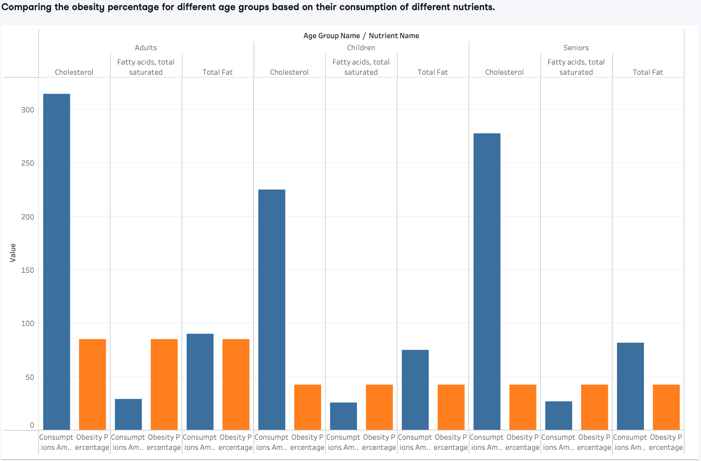

## Major nutrients and obesity rate by ages.

#### Clean and process .csv files using Python code
#### Load tables via SQL to run SQL query analysis. 
#### Visualized result with Tableau.

## Project description
In this project, our aim is to analyze the relationship between the consumption of specific dairy products—butter, cheese, cream, yogurt, and ice-cream 
and obesity rates across various age groups in 2017-2018. 
Our methodology involves collecting nutritional data for these dairy products, with a primary focus on fat, saturated fat, and cholesterol. 

The analysis comprises two main parts. Firstly, we will compare nutrient intake with obesity rates on an age-by-age basis. 
Subsequently, we will compare the selected nutrient values in ingredients for the age group with the highest obesity rates. 

## Workflow

Data Collection

- Download and convert each .csv datasets from the web.
- Upload to datacamp workplace for access.
- Clean and process the original .csv files by removing unnecessary columns and rows. Save the refined data into a new .csv file for further actions using Python code.
- Manage synonums by manully create new age_groups.csv, age_group_names.csv and nutrient_names.csv files for look up.

SQL Database Initialization
- Execute SQL commands via Python to create the necessary tables and attributes  according to our ER diagram.

Parsing Data and Loading into SQL Database

- Use Python to read 'nutrient_names.csv' and write nutrient names synonyms and correspond nutrient id into **nutrient_names table**
- Read 'ingredient_values_processed.csv' and write ingredient names and id into **ingredients table.**
- Read 'ingredient_values_processed.csv' and write nutrient names and id into **nutrients table.**
- Read 'age_groups.csv' and write in new age group names we created and id into **age_groups table.**
- Read 'age_group_names.csv' and write all age_group_name synonyms into names column and their corresponding age_group_id in **age_group_names table.**
- Read 'age_group_names.csv' and 'obesity_age_processed'. Replace the age_group in obesity_age_processed.csv to age_group_id from age_group_names.csv and create **consumer table.**
- Read 'ingredient_values_processed.csv' write ingredient_id, nutrient_id and value in **nutrient_in_ingredients table.**
- Read 'age_group_names.csv' and 'nutrient_names.csv' to create look up in order to replace the original synonyms. Read 'nutrient_intake_processed.csv' and write amount, age_group_id and nutrient_id into **consumptions table.**

Export for Analysis

- Query age_group_names, age_groups, consumers, consumptions tables to compile standard age_group_name, nutrient_name, consumptions_amount and obesity_percentage in **'nutrient_intake_obesity_ages.csv' file.**
- Query age_group_names, age_groups, consumptions, nutrients, nutrient_names, nutrient_in_ingredients, ingredients table to compile standard nutrient name, nutrient_value and ingredient_name. Filter 'Adult' age_group and create **'nutrient_value_in_ingredients.csv' file.**

Analysis Chart

- Upload .csv files to Tableau and produce charts.

## ER Diagram

## Project Challenges Highlight
1. ### Managing Synonyms and Designing Database:
   ##### Dataset details:
   -Contains intricate information about ingredients and nutrient names.
   -Need to link these various names to other entities effectively.
   ##### Age-grouping statistics:
   -Datasets present different age ranges and names
   ##### Approach:
   -Created a new entity by extracting entire age groups and nutrient name categories.
   -Defined a unified ID for seamless data linkage.

3. ### Cleaning Multi-Header Datasets:
   -Skip redundant lines during file reading.
   -Address merged cells in headers.
   -Transform headers to align with desired data structure.
   -Index from target rows

5. ### Processing Multi-Tables in One Dataset:
   ##### Dataset structure:
   -Consists of one main table interspersed with multiple sub-tables.
   ##### Processing challenge:
   -Need to create new columns while recognizing distinct sub-table groups.
   ##### Solution:
   -Utilized redundant rows in each sub-table to generate a flag using conditional if-else coding.
   -When encountering the "flag" value, ceased data insertion into new CSV file.
   -Jumped to the next sub-table to start a new iteration.
